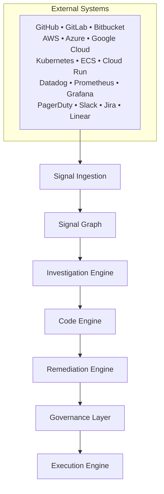

# Scrubbe

### Autonomous Incident Response for Engineering Organizations

Scrubbe is an autonomous incident response platform that helps engineering teams investigate, understand, and resolve production incidents through **AI-powered operational intelligence**.

During production incidents, Scrubbe deploys specialized AI agents that investigate code changes, CI/CD pipelines, infrastructure signals, alerts, logs, and service dependencies in parallel. The platform correlates what changed, identifies the most likely root cause, determines safe remediation paths, verifies expected impact, and executes approved remediation under policy controls.

Scrubbe handles the complete incident response lifecycle—from signal ingestion and investigation through remediation, verification, and post-incident learning.

---

## Why Scrubbe Exists

Modern production environments have become increasingly complex. Engineering teams operate across dozens of fragmented systems including source control, cloud providers, and Kubernetes clusters.

When incidents occur, critical information is scattered, forcing responders to manually gather evidence and coordinate teams while production impact grows. **Scrubbe was built to reduce the gap between incident detection and safe resolution.**

---

## Core Capabilities

- **Autonomous Investigations:** Deploy specialized AI agents across code, infrastructure, and delivery pipelines simultaneously.
- **Root Cause Intelligence:** Correlate signals to identify likely causes, contributing factors, and propagation paths.
- **Signal Graph:** Build operational relationships between services, deployments, infrastructure, incidents, and teams.
- **Governed Remediation:** Execute approved workflows under policy controls, approval gates, and audit requirements.
- **Operational Memory:** Capture investigation outcomes and history to improve future response.

---

## Platform Architecture



---

## Product Components

| Component                 | Description                                                                 |
| ------------------------- | --------------------------------------------------------------------------- |
| **Architecture**          | Platform-wide orchestration model connecting all engines and intelligence.  |
| **Investigations**        | Autonomous analysis and causal reasoning across production systems.         |
| **Signal Ingestion**      | Continuous ingestion of alerts, telemetry, deployments, and runtime events. |
| **Signal Graph**          | Cross-system correlation and operational relationship mapping.              |
| **Code Engine**           | Repository-aware analysis of commits, PRs, and releases.                    |
| **Pipeline Intelligence** | Understanding of CI/CD runs, changes, and deployment failures.              |
| **Governance**            | Policy enforcement, approval workflows, and blast-radius controls.          |
| **Execution Engine**      | Controlled execution of approved remediation actions.                       |

---

## Supported Integrations

### Source Control & Cloud

- **Source Control:** GitHub, GitLab, Bitbucket
- **Cloud Platforms:** AWS, Microsoft Azure, Google Cloud
- **Containers:** Amazon EKS/ECS, Azure AKS, Google GKE, Self-managed K8s

### Observability & Management

- **Observability:** Datadog, Prometheus, Grafana, New Relic
- **Incident Management:** PagerDuty, Opsgenie, ServiceNow
- **Work & Collaboration:** Slack, Microsoft Teams, Jira, Linear

---

## Incident Lifecycle

1. **Signal Detection**
2. **Signal Correlation**
3. **Incident Creation**
4. **Autonomous Investigation**
5. **Root Cause Analysis**
6. **Remediation Planning**
7. **Approval Workflow**
8. **Execution**
9. **Verification**
10. **Post-Incident Learning**

---

## Repository Structure

```text
scrubbe/
├── apps/
│   ├── web/ | api/ | workers/ | docs/
├── packages/
│   ├── agents/ | connectors/ | investigations/
│   ├── signal-graph/ | governance/ | execution/
│   ├── playbooks/ | auth/ | shared/
├── infrastructure/
│   ├── kubernetes/ | terraform/ | monitoring/
└── docs/ | scripts/

```

---

## Getting Started

### Prerequisites

- Node.js
- PostgreSQL & Redis
- Docker
- Kubernetes (optional)

### Local Setup

```bash
git clone https://github.com/scrubbehq/scrubbe.git
cd scrubbe
pnpm install
pnpm dev

```

### Configuration

Create a local `.env` file from `.env.example`.

> [!IMPORTANT]
> Never commit `.env` files, secrets, tokens, or credentials to source control.

---

## Security

Scrubbe is built on enterprise security principles:

- **RBAC:** Role-based access control.
- **Least-Privilege:** Minimal access integrations.
- **Auditability:** Full logging and approval workflows.
- **Safety:** Tenant isolation and blast-radius enforcement.

---

## Vision

The future of operations is not more dashboards or alerts; it is **operational intelligence**. Engineering organizations need systems capable of reasoning across complex environments to coordinate safe responses. Scrubbe is building that intelligence layer.

---

## License & Support

**Copyright © Scrubbe. All rights reserved.**

- **Website:** [https://scrubbe.com](https://scrubbe.com)
- **Docs:** [https://docs.scrubbe.com](https://docs.scrubbe.com)
- **Support:** support@scrubbe.com

---

**Scrubbe connects operational signals to safe action.**

Would you like to explore the **Architecture** or **API Reference** sections in more detail?
